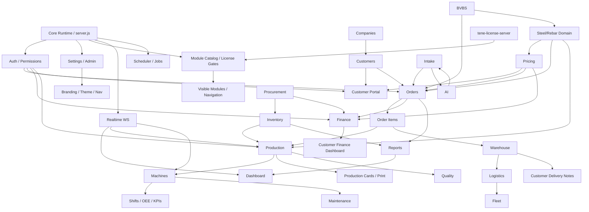

# IronBend Project Dependency Graph

Generated: 2026-06-24

## High-Level Graph

## Key Dependency Chains

### Order Fulfillment Chain

Orders
-> Customers
-> Pricing
-> Steel/Rebar Shapes
-> Items
-> Production
-> Machines
-> Production Cards
-> Warehouse
-> Logistics
-> Finance
-> Reports

### Customer Portal Chain

Customer Portal
-> Portal Access
-> Customers
-> Customer Sites
-> Portal Users
-> Pricing
-> Shapes
-> Orders
-> Finance
-> Invoices / Delivery Notes / Guarantees

### Intake to Production Chain

Intake
-> OCR / AI
-> Intake Review
-> Order Import
-> Orders
-> Shape Editor
-> Steel/Rebar Calculations
-> Production Queue
-> Machine Execution

### Finance Chain

Finance
-> Orders
-> Order Costs
-> Pricing
-> Steel Prices
-> Customer Credit
-> Invoices
-> Financial Events
-> Customer Portal Finance Dashboard

### Procurement and Inventory Chain

Procurement
-> Suppliers
-> Steel Prices
-> Purchase Orders
-> Inventory Receipt Reviews
-> Raw Material
-> Raw Material Usage
-> Production
-> Finance Costs

### Warehouse and Delivery Chain

Warehouse
-> Packages
-> Delivery Notes
-> Logistics Deliveries
-> Fleet / Drivers / Vehicles
-> Customer Portal Delivery Visibility
-> Reports

### Quality and Maintenance Chain

Production
-> Machines
-> Quality Checks
-> Incidents
-> NCR / CAPA
-> Maintenance Logs
-> LOTO
-> PM Schedule
-> Reports

### License and Navigation Chain

License Server
-> License Service
-> Module Catalog
-> Module Gates
-> Route Manifests
-> Navigation
-> Role Permissions
-> Visible Screens and APIs

## Parallel Development Boundaries

| Boundary | Primary Owners | Shared Conflict Points |
| --- | --- | --- |
| Customer Portal | Portal/customer team | `routes/portal.js`, `services/portalAccess.js`, `public/customer.html`, `customers`, `orders`, `pricing_*`, `invoices` |
| Pricing / Finance | Finance team | `routes/catalog.js`, `routes/finance*.js`, `services/pricer.js`, `db/financeSchema.js` |
| Production / Machines | Production team | `routes/production*.js`, `modbus.js`, `items`, `machines`, `production_events` |
| Intake | Intake/OCR team | `routes/intake*.js`, `services/intakeWorkflow.js`, `public/intake.html`, `orders`, `items` |
| Inventory / Procurement | Materials team | `routes/inventory*.js`, `routes/procurement.js`, `raw_material`, `purchase_orders`, `steel_prices` |
| Warehouse / Logistics | Dispatch team | `routes/warehouse.js`, `routes/logistics.js`, `routes/fleet.js`, `packages`, `delivery_notes`, `deliveries` |
| Core / Admin / License | Platform team | `server.js`, `shared/module-catalog.json`, `routes/admin.js`, `services/settings.js`, `public/nav.js` |

## Notes for Conflict-Free Work

- Prefer editing a module route/service/screen instead of `server.js` when possible.
- Keep customer-facing work inside `routes/portal.js`, `routes/portalAdmin.js`, `services/portalAccess.js`, and `public/customer.html`.
- Changes to `db/coreSchema.js`, `db/startup.js`, `shared/module-catalog.json`, `public/nav.js`, and `public/theme.css` affect many modules and should be serialized.
- Use `TASKS_V2.md` as the ownership ledger before changing implementation files.
