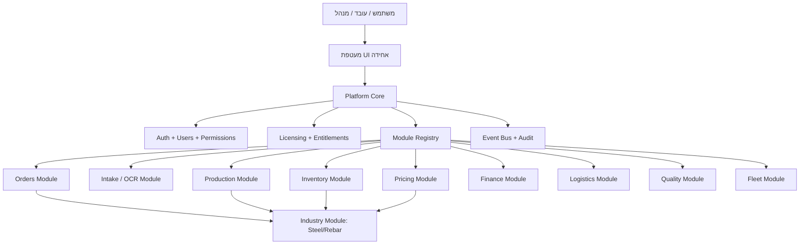
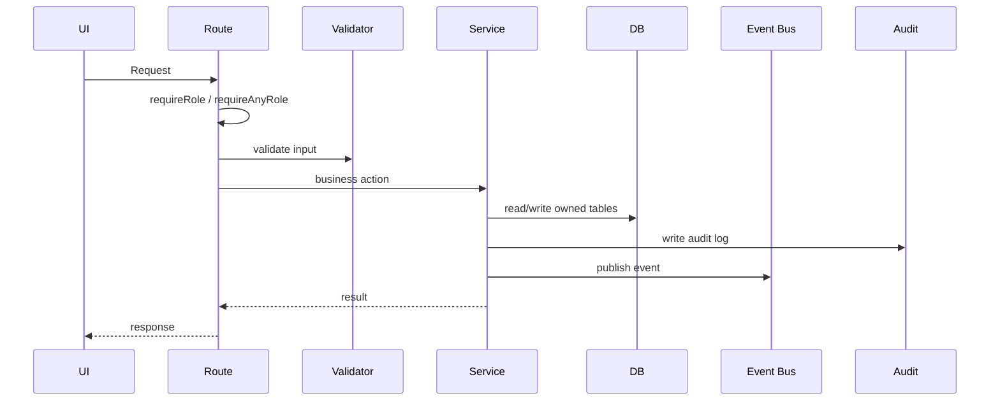
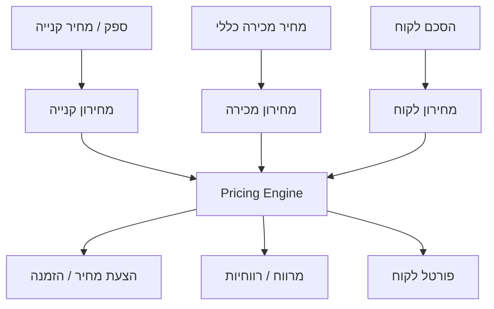
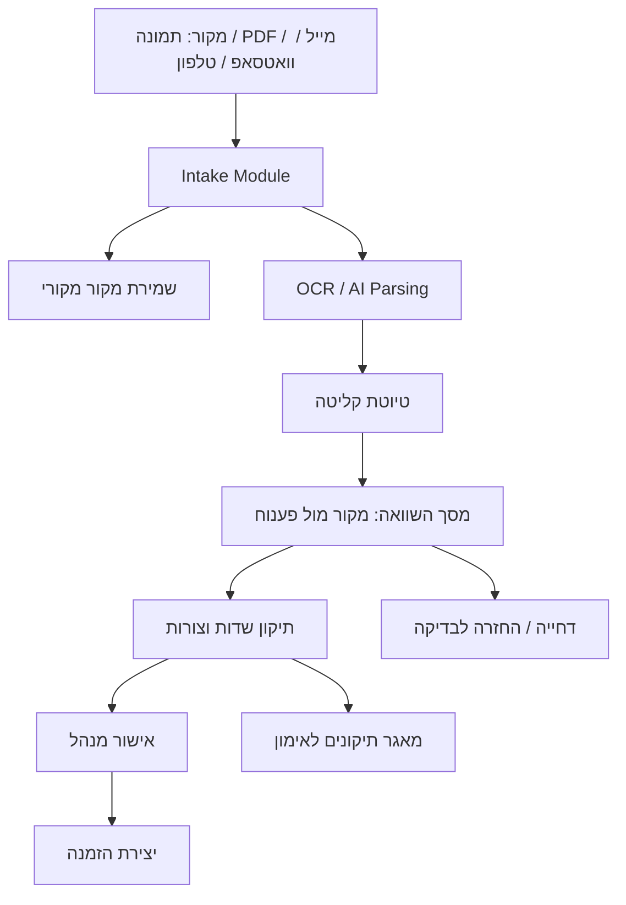
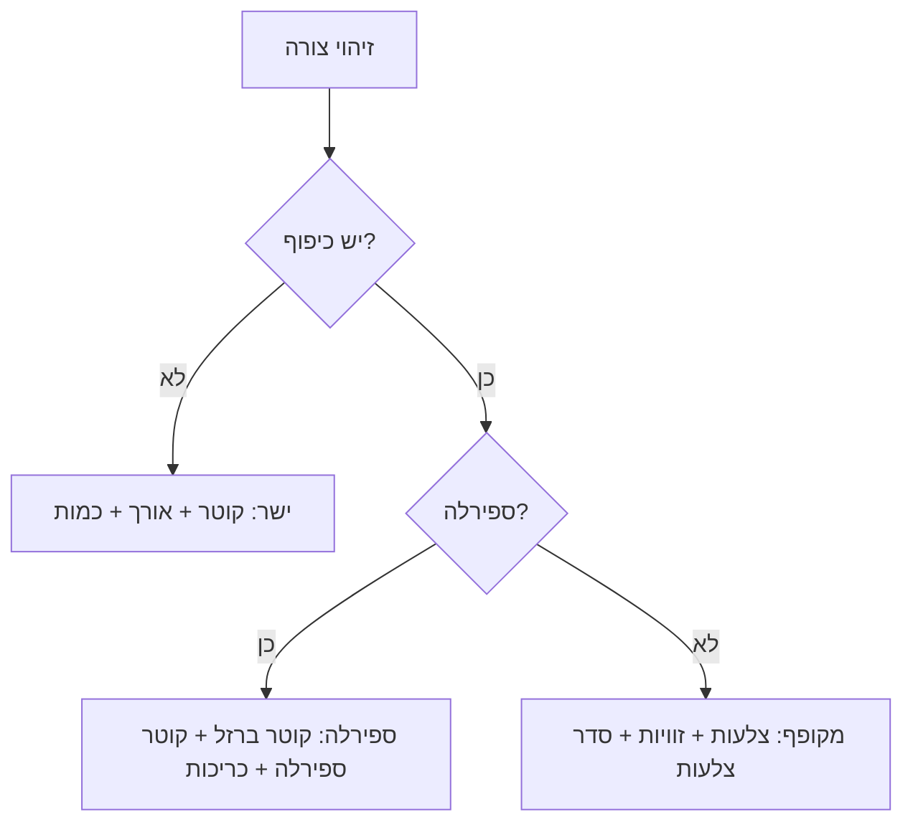
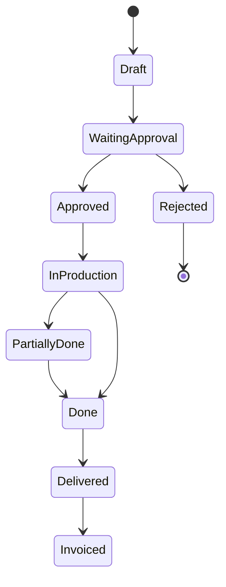
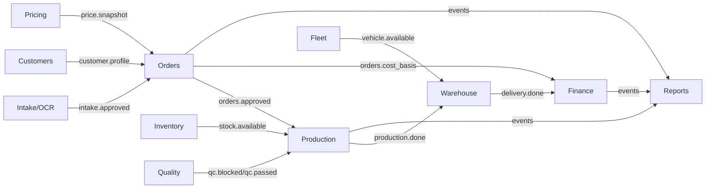
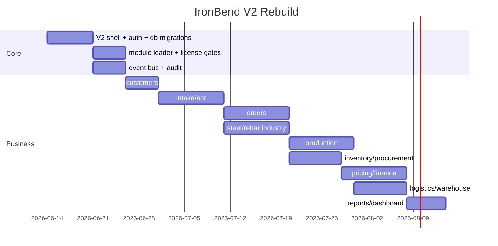

# IronBend V2 — מסמך אמת לפרויקט מודולרי

מסמך זה הוא מקור האמת לבנייה מחדש של IronBend כמערכת תעשייתית מודולרית, נקייה, ניתנת למכירה לפי מודולים, וניתנת להרחבה ללקוחות ותעשיות שונות.

המטרה אינה “לתקן מסך”. המטרה היא לבנות מוצר שאפשר למכור, לתחזק, להפעיל מרחוק, ולפתח עליו מודול חדש בלי לשבור מודול קיים.

---

## 1. משפט מוצר

IronBend היא פלטפורמה לניהול מפעלים ותהליכי ייצור, שמתחילה בענף ברזל/כיפוף ברזל, אבל בנויה כך שכל לקוח יקבל רק את המודולים שהוא רכש: הזמנות, קליטה חכמה, ייצור, מלאי, רכש, מחירונים, כספים, לוגיסטיקה, איכות, צי רכב, דוחות ואינטגרציות.

---

## 2. ההחלטה האדריכלית המרכזית

המערכת נבנית כ־Platform Core + Feature Modules + Industry Modules.



### Core

Core הוא התשתית בלבד:

- התחברות, משתמשים והרשאות.
- רישוי ומודולים פעילים.
- טעינת מודולים.
- Event Bus.
- Audit Log.
- DB connection.
- migrations.
- UI shell וניווט.

Core לא יודע לחשב משקל ברזל, לא יודע איך נראית ספירלה, לא יודע מה זה תעודת משלוח ספק, ולא יודע איך מאשרים הזמנה. אלו שייכים למודולים.

### Feature Module

מודול עסקי עצמאי כמו Orders, Inventory, Finance, Intake.

### Industry Module

מודול ענפי שמגדיר חוקי תחום:

- Steel/Rebar: קטרים, משקלים, צורות כיפוף, BVBS, חישוב אורך, כרטיסי ייצור.
- בעתיד: נגרות, אלומיניום, אריזה, מפעל אחר.

Feature Module יכול להשתמש ב־Industry Module דרך API/Service מוגדר, לא דרך קוד פרטי.

---

## 3. כלל ברזל: אין מונולית

אין `server.js` שמחזיק לוגיקה עסקית.

`server.js` ב־V2 עושה רק:

1. טעינת env.
2. פתיחת DB.
3. טעינת Core.
4. טעינת מודולים לפי רישוי.
5. Mount ל־routes.
6. Health check.
7. הפעלת שרת.

אסור:

- להוסיף route חדש ישירות ל־server.js.
- להוסיף פונקציית עזר עסקית ל־server.js.
- להוסיף SQL עסקי ל־server.js.
- להשתמש ב־global state לא מתועד.

---

## 4. חוזה מודול

כל מודול חייב להיות תיקייה עצמאית עם מבנה קבוע:

```text
modules/
  orders/
    module.manifest.js
    routes.js
    service.js
    schema.sql
    migrations/
    events.js
    validators.js
    permissions.js
    ui/
      orders.html
      orders.css
      orders.js
    tests/
      orders.routes.test.js
      orders.service.test.js
    README_HE.md
```

### module.manifest.js

כל מודול מצהיר מי הוא, מה הוא צורך ומה הוא מפיק.

```js
module.exports = {
  id: 'orders',
  title: 'הזמנות',
  type: 'feature',
  licenseKey: 'orders',
  owns: {
    routes: ['/api/orders'],
    tables: ['orders', 'order_items', 'order_status_history'],
    screens: ['/orders.html', '/index.html?newOrder=1'],
  },
  consumes: [
    { type: 'event', name: 'intake.approved' },
    { type: 'service', module: 'customers', name: 'getCustomer' },
    { type: 'service', module: 'pricing', name: 'quoteOrder' },
  ],
  produces: [
    { type: 'event', name: 'orders.created' },
    { type: 'event', name: 'orders.status_changed' },
  ],
};
```

### routes.js

כל routes הם factory function עם Dependency Injection.

```js
const router = require('express').Router();

function required(name, value) {
  if (!value) throw new Error(`orders module missing dependency: ${name}`);
  return value;
}

module.exports = function createOrdersRouter(deps) {
  const db = required('db', deps.db);
  const requireAnyRole = required('requireAnyRole', deps.requireAnyRole);
  const auditLog = required('auditLog', deps.auditLog);
  const eventBus = required('eventBus', deps.eventBus);
  const orders = required('ordersService', deps.ordersService);

  router.get('/orders', requireAnyRole(['sales', 'manager', 'admin']), async (req, res) => {
    const result = await orders.list(req.query);
    res.json(result);
  });

  return router;
};
```

אסור ל־route:

- לפתוח DB חדש.
- לקרוא ישירות לטבלאות של מודול אחר.
- לבצע חישובים עסקיים גדולים.
- להחזיר רשימה בלי pagination.
- לכתוב בלי audit.
- לשנות status בלי status transition.

---

## 5. חמש שורות חובה בכל endpoint

כל endpoint חדש חייב להוכיח:

1. Auth: `requireRole` או `requireAnyRole`.
2. Validation: schema ל־body/query/params.
3. Business service: הלוגיקה ב־service, לא ב־route.
4. Audit: על כל כתיבה.
5. Event: על כל שינוי מצב או פעולה שמודול אחר צריך לדעת עליה.



---

## 6. מקור אמת לנתונים

לכל נתון יש בעלים אחד בלבד.

| תחום | מקור אמת | מי קורא | מי כותב |
|---|---|---|---|
| משתמשים והרשאות | Core/Auth | כולם דרך service | Auth/Admin בלבד |
| לקוחות | Customers | Orders, Finance, Portal | Customers בלבד |
| הזמנות | Orders | Production, Finance, Reports | Orders בלבד |
| פריטי הזמנה | Orders + Industry | Production, Cards | Orders בלבד |
| צורות ברזל | Steel/Rebar | Orders, Production, OCR | Steel/Rebar בלבד |
| מלאי | Inventory | Orders, Production, Finance | Inventory בלבד |
| מחיר קנייה | Pricing/Procurement | Finance, Inventory | Pricing/Procurement |
| מחיר מכירה | Pricing | Orders, Finance, Portal | Pricing |
| מחיר לקוח | Pricing/Customers | Orders, Finance, Portal | Pricing + Customers |
| חשבוניות | Finance | Reports, Portal | Finance בלבד |
| תעודות משלוח | Logistics/Warehouse | Orders, Finance, Portal | Logistics בלבד |
| OCR raw docs | Intake | Orders, Training | Intake בלבד |
| OCR corrections | Intake Training | OCR | Intake בלבד |

אם מודול צריך נתון של מודול אחר, הוא לא נוגע בטבלה ישירות. הוא משתמש ב־service/API/event.

---

## 7. מחירונים — לקח מרכזי

מחירון ברזל משתנה כל הזמן, ולחלק מהלקוחות יש מחירון שהם מכתיבים.

לכן אין “מחירון אחד”.



### כללים

- מחיר קנייה משמש לחישוב עלות ורווחיות.
- מחיר מכירה משמש כברירת מחדל להצעה.
- מחיר לקוח גובר על מחיר מכירה אם קיים.
- אין לערבב בין `purchase_price`, `sales_price`, `customer_price`.
- כל מחיר נשמר עם תוקף תאריך: `valid_from`, `valid_to`.
- כל חישוב כספי נשמר עם snapshot כדי ששינוי מחיר בעתיד לא ישנה הזמנות עבר.

---

## 8. OCR וקליטת הזמנות — לקח מרכזי

OCR לעולם לא יוצר הזמנה סופית בלי אישור.

הזרימה הנכונה:



### מסך השוואה חובה

המשתמש חייב לראות:

- מסמך מקור בצד אחד, עם זום וגלילה.
- טופס פענוח בצד שני, בסגנון טופס הזמנה.
- לכל שורה: צורה ויזואלית, קוטר, אורך/מידות, כמות, משקל משוער, הערות חריגה.
- שדות עם ביטחון נמוך מסומנים.
- לחיצה על צורה פותחת עורך צורה.
- אין להשוות מול “מלל ארוך”. משווים מול נתונים וצורה.

### הערות OCR

הערות AI לא מוצגות כטקסט ענק בכרטיס הזמנה. הן נכנסות ל־Review Details או Log.

---

## 9. חוקי צורות ברזל

צורות הן חלק מ־Industry Module: `steel-rebar`.

### ישר

אם זוהה ברזל ישר:

- אין זוויות.
- יש קוטר.
- יש אורך.
- יש כמות.

### מקופף

אם זוהה ברזל מקופף:

- יש צלעות.
- יש זוויות.
- צריך סדר צלעות ברור.
- עודף אורך מתחלק לקצוות לפי החוק שהוגדר, לא כסתם “הפרש”.

### ספירלה

אם זוהתה ספירלה:

- אין זוויות.
- יש קוטר ברזל.
- יש קוטר ספירלה.
- יש מספר כריכות.
- אופציונלי: פסיעה / גובה אם יש צורך ייצור.

### חישוק

סימון חישוק הוא מלבן/ריבוע עם סימון קטן פנימי בפינה. הסימון תמיד כלפי פנים. זה סמל, לא צלע נוספת.



---

## 10. מודולים ראשיים ב־V2

### 10.1 Core/Auth

מטרה: זהות, הרשאות, כניסה, משתמשים.

Inputs:

- שם משתמש וסיסמה/PIN.
- role.
- הרשאות.

Outputs:

- access token.
- refresh token.
- `req.auth`.
- audit events.

Logic:

- JWT יציב מ־env.
- אין fallback אקראי בייצור.
- role לא מגיע מ־header שניתן לזיוף.
- WebSocket מאומת.

Owned screens:

- login.
- users/admin.
- profile/session.

---

### 10.2 Licensing & Entitlements

מטרה: לקבוע אילו מודולים פתוחים לכל לקוח.

Inputs:

- license key.
- machine/customer id.
- active users count.
- module catalog.

Outputs:

- package.
- enabled modules.
- max users.
- warnings.

Logic:

- Free mode: הכל פתוח לפיתוח/בדיקה אם אין רישיון.
- Production customer: רק מודולים מורשים.
- אכיפת `requireModule(key)` לפני routes.
- חריגת משתמשים היא אזהרה רכה, לא עצירת מפעל באמצע יום.

Owned screens:

- admin/modules.
- license status.

---

### 10.3 Customers

מטרה: ניהול לקוחות, אנשי קשר, כתובות, תנאי מחיר.

Inputs:

- פרטי לקוח.
- אנשי קשר.
- כתובות אספקה.
- תנאי תשלום.
- מחירון לקוח.

Outputs:

- customer profile.
- customer id.
- portal access.
- pricing overrides.

Logic:

- לקוח אינו “שדה בתוך הזמנה”. הוא entity עצמאי.
- במסך הזמנה חדשה מחפשים לקוח או פותחים לקוח מינימלי.
- פרטי עומק של לקוח נמצאים במסך לקוח.

Owned screens:

- customers list.
- customer detail.
- customer pricing.
- customer portal access.

---

### 10.4 Order Intake / OCR

מטרה: קבלת הזמנות מכל מקור והפיכתן לטיוטה לאישור.

Inputs:

- PDF.
- תמונה.
- WhatsApp.
- Email.
- טלפון/ידני.
- CSV/TSV.

Outputs:

- intake draft.
- parsed order lines.
- confidence report.
- source document.
- corrections.
- approved order request.

Logic:

- כל מקור נשמר.
- OCR מייצר טיוטה בלבד.
- אישור תמיד מול מקור.
- הערות דורשות מסלול אישור.
- אם יש שגיאה בשורה, היא מופיעה במרכז קליטה ולא נעלמת בתוך הזמנה.

Owned screens:

- intake center.
- OCR compare.
- OCR training.
- manual intake.

---

### 10.5 Orders

מטרה: ניהול הזמנות מאושרות, סטטוסים, פריטים, שינוי הזמנה.

Inputs:

- intake approved draft.
- manual order.
- customer.
- pricing quote.
- rebar shape items.

Outputs:

- order.
- order items.
- production request.
- cards request.
- finance snapshot.
- status events.

Logic:

- הזמנה יכולה להיווצר רק מלקוח תקין או לקוח זמני ברור.
- שינוי כרטיסיות אחרי ייצור מחייב הדפסת מאסטר חדש.
- פיצול כרטיסיות מחלק כמות וממספר מחדש.
- סטטוסים עובדים רק לפי transition table.

Owned screens:

- orders list.
- order detail.
- new order.
- order edit.
- card split/print.

Order lifecycle:



---

### 10.6 Steel/Rebar Industry

מטרה: חוקי ברזל וכיפוף.

Inputs:

- קוטר.
- צורה.
- צלעות.
- זוויות.
- תקן פלדה.
- כמות.

Outputs:

- אורך פריסה.
- משקל.
- BVBS.
- SVG/visual shape.
- validation warnings.

Logic:

- `rebarKgPerMeter()` מקור אמת אחד.
- אין נוסחאות inline במודולים אחרים.
- צורה ויזואלית חייבת להיות עקבית בין OCR, הזמנה, כרטיס ייצור והדפסה.

Owned screens:

- shape editor.
- shape catalog.
- production card visual.

---

### 10.7 Production

מטרה: ביצוע ייצור בפועל.

Inputs:

- approved order items.
- production cards.
- machine availability.
- worker updates.

Outputs:

- produced quantity.
- actual weight.
- machine status.
- production events.

Logic:

- לכל כרטיס יש משקל רצוי.
- עובד מזין משקל מצוי.
- חריגה באחוזים מייצרת התראה.
- סטטוס כרטיס מתקדם לפי פעולת עובד.

Owned screens:

- worker station.
- machine screen.
- production dashboard.
- card scan/update.

---

### 10.8 Inventory / Procurement

מטרה: מלאי חומר גלם, קבלת חומר, ספקים, תעודות משלוח ספק.

Inputs:

- supplier delivery note.
- manual receiving.
- OCR receiving.
- purchase order.
- steel type/diameter/weight.

Outputs:

- inventory lot.
- stock movement.
- supplier receipt draft.
- approval request.

Logic:

- קבלת חומר למלאי חייבת OCR משלה, לא OCR הזמנות.
- עובד מצלם תעודת משלוח ספק.
- מנהל מאשר מול מקור.
- רק לאחר אישור המלאי מתעדכן.

Owned screens:

- inventory.
- receiving center.
- supplier delivery compare.
- stock movements.

---

### 10.9 Pricing

מטרה: מנוע מחירונים וחישובי מחיר.

Inputs:

- purchase price.
- sales price.
- customer price.
- customer.
- product/shape.
- date.

Outputs:

- quoted unit price.
- cost estimate.
- margin basis.
- price snapshot.

Logic:

- מחיר לקוח גובר על מחיר מכירה.
- מחיר קנייה משמש לעלות.
- כל מחיר מחושב לפי תאריך.
- החישוב מחזיר גם “למה” נבחר המחיר.

Owned screens:

- pricing admin.
- purchase price import.
- customer price list.
- pricing history.

---

### 10.10 Finance

מטרה: עלויות, מרווחים, חשבוניות, אשראי.

Inputs:

- orders.
- pricing snapshots.
- production actuals.
- customer ledger.
- invoices.

Outputs:

- invoice.
- margin.
- customer balance.
- credit warning.

Logic:

- Finance לא מכתיב מחיר; הוא משתמש ב־Pricing snapshot.
- אין כפילות לא מוסברת בין סוגי אשראי.
- כל פעולה כספית נרשמת ב־audit.

Owned screens:

- finance dashboard.
- invoices.
- customer ledger.
- margins.

---

### 10.11 Warehouse / Logistics

מטרה: אספקה, אריזות, תעודות משלוח, משלוחים.

Inputs:

- completed production.
- delivery address.
- vehicle/driver assignment.
- packages.

Outputs:

- delivery note.
- shipment.
- delivery status.

Logic:

- רכב ונהג הם entities נפרדים.
- משלוח שייך ללוגיסטיקה, לא ל־Fleet.
- תעודת משלוח נוצרת מהזמנה/משטחים מאושרים.

Owned screens:

- deliveries.
- packages.
- delivery notes.
- dispatch board.

---

### 10.12 Fleet

מטרה: ניהול רכבים ונהגים.

Inputs:

- vehicles.
- drivers.
- documents.
- insurance/test/service dates.
- expenses.

Outputs:

- vehicle health.
- driver availability.
- document alerts.
- expense reports.

Logic:

- רכב != נהג.
- לכל רכב יש מסמכים, טיפולים, ביטוח, טסט, הוצאות והכנסות.
- Fleet מספק זמינות ללוגיסטיקה, לא מנהל משלוחים בעצמו.

Owned screens:

- vehicles.
- drivers.
- vehicle detail.
- driver detail.
- fleet documents.

---

### 10.13 Quality / Maintenance

מטרה: בקרת איכות, NCR, CAPA, תקלות, תחזוקה.

Inputs:

- quality checks.
- incidents.
- machine faults.
- maintenance logs.

Outputs:

- QC status.
- NCR.
- CAPA.
- machine status update.

Logic:

- איכות יכולה לעצור פריט/הזמנה לפי הרשאות.
- תקלה במכונה מעדכנת מצב מכונה.
- סגירת תקלה מחזירה מצב לפי state machine.

Owned screens:

- quality center.
- maintenance.
- NCR/CAPA.
- incidents.

---

### 10.14 Reports / Dashboard

מטרה: תצוגת בקרה, KPI, דוחות.

Inputs:

- events.
- orders.
- production.
- finance.
- inventory.

Outputs:

- dashboard cards.
- exports.
- KPI charts.

Logic:

- Reports הוא read-only.
- אין כתיבה עסקית מתוך Reports.
- דוחות משתמשים ב־views/services, לא מעתיקים חישובים.

Owned screens:

- dashboard.
- reports.
- exports.

---

### 10.15 Integrations

מטרה: חיבורים חיצוניים.

Inputs/Outputs:

- WhatsApp.
- Email.
- OpenAI Vision.
- Priority.
- payment provider.
- remote support.

Logic:

- כל אינטגרציה עטופה adapter.
- מודול עסקי לא קורא API חיצוני ישירות.
- כשאין מפתח API, המערכת מציגה בעיית הגדרה ברורה ולא קורסת.

---

## 11. מפת מודולים חיה

כל מודול מצהיר `consumes` ו־`produces`. מרכז הבקרה מצייר אוטומטית.



המערכת חייבת להראות:

- מודול.
- כמה כניסות יש לו.
- כמה יציאות יש לו.
- אירוע אחרון שנראה.
- האם אירוע שמוצהר באמת קרה.

---

## 12. מסכים — כלל תכנון

כל מסך מקבל אפיון לפני בנייה:

1. מי המשתמש.
2. מה הפעולה המרכזית.
3. מה אסור להציג שם.
4. איזה מודול בעלים של המסך.
5. אילו API הוא צורך.
6. אילו מצבים קיימים.
7. איך זה נראה בדסקטופ.
8. איך זה נראה בטאבלט/מובייל.
9. מה קורה בשגיאה.
10. מה Definition of Done.

אסור:

- מסך שמערבב כמה אחריויות בלי סיבה.
- כרטיס עם טקסט AI ארוך במקום נתונים.
- כפתור “עריכה” שיוצר entity חדש.
- קובץ input שמוגדר כתיקייה או חוסם PDF/תמונה.
- חלון קטן להשוואת עשרות פריטים.

---

## 13. פרוטוקול עבודה עם סוכנים

בתחילת כל סשן:

1. `git pull`.
2. לקרוא את `START_HERE.md`.
3. לקרוא את מסמך האמת הזה.
4. לקרוא `TASKS.md`.
5. לבחור משימה אחת בלבד.
6. לוודא שאין סוכן אחר על אותם קבצים.

לפני ביצוע:

1. לעדכן משימה ל־`in_progress`.
2. לציין owner.
3. לציין scope של קבצים.
4. לעשות commit רק ל־TASKS אם צריך claim.

במהלך ביצוע:

- לא לגעת בקבצים מחוץ ל־scope.
- אם מתגלה צורך לגעת במודול אחר, עוצרים ומעדכנים.
- לא “לשפר בדרך” דברים שלא סוכמו.
- אם הכיוון לא נכון, עוצרים ומסבירים למה.

בסיום:

- בדיקות ממוקדות למודול.
- בסוף מודול בלבד: full test.
- עדכון docs של המודול.
- עדכון governance אם route נוסף.
- commit עם pathspec מפורש.

---

## 14. Definition of Done למודול

מודול נחשב גמור רק אם:

- יש `module.manifest.js`.
- יש README_HE עם מטרה, input, output, logic.
- כל route מוגן בהרשאות.
- כל input עובר validation.
- כל כתיבה נרשמת ב־audit.
- כל שינוי מצב מפרסם event.
- כל LIST כולל pagination.
- כל status entity כולל transitions.
- אין SQL לטבלאות של מודול אחר.
- יש בדיקות service.
- יש בדיקות route.
- יש בדיקת governance.
- יש מסך אחד לפחות או API documented.
- אין קוד חדש ב־server.js חוץ מ־mount.

---

## 15. תוכנית בנייה מחדש

לא בונים הכל מחדש בבת אחת. בונים V2 Shell ואז מעבירים מודולים אחד אחד.



### סדר מומלץ

1. Core Shell.
2. Auth/Users.
3. Module Registry + Licensing.
4. Customers.
5. Steel/Rebar Industry.
6. Intake/OCR.
7. Orders.
8. Production.
9. Inventory/Procurement.
10. Pricing.
11. Finance.
12. Warehouse/Logistics.
13. Fleet.
14. Quality.
15. Reports.
16. Integrations.

---

## 16. מה למדנו שאסור לחזור עליו

- לא לבנות מונולית ואז “לפצל אחר כך”.
- לא לערבב מסכי עבודה עם מסכי הגדרה.
- לא לשמור OCR כמלל בלי מקור.
- לא לאשר OCR בלי השוואה ויזואלית.
- לא להציג צורה כקו ישר כשזוהתה ספירלה.
- לא לערבב ספירלה עם זוויות.
- לא לערבב נהג ורכב.
- לא לערבב מחיר קנייה ומחיר מכירה.
- לא להשאיר הערות AI ארוכות בכרטיס הזמנה.
- לא לבנות מסך שאי אפשר להשתמש בו בטאבלט/טלפון.
- לא לפתוח “עריכה” שיוצרת הזמנה חדשה.
- לא להסתיר שגיאה מאחורי הודעה כללית.
- לא להסתמך על localhost לפרודקשן.
- לא להכניס שינוי בלי מסלול בדיקה.

---

## 17. משפט פתיחה לכל סוכן שבונה מודול

לפני שאתה כותב קוד:

1. קרא את המסמך הזה.
2. כתוב מה המודול שלך.
3. כתוב מה הקלט שלו.
4. כתוב מה הפלט שלו.
5. כתוב איזה טבלאות הוא הבעלים שלהן.
6. כתוב איזה מודולים הוא צורך.
7. כתוב איזה events הוא מפיק.
8. כתוב מה לא שייך אליו.
9. כתוב איך תבדוק אותו.
10. רק אחרי זה תתחיל קוד.

---

## 18. כלל הסיום

IronBend V2 היא לא “מערכת הזמנות ברזל”.

היא פלטפורמה מודולרית לניהול מפעל, כאשר ברזל הוא מודול ענפי ראשון.

כל החלטה נבחנת לפי שאלה אחת:

האם אפשר למכור את המערכת ללקוח אחר עם מודולים אחרים בלי לפרק את הקוד?

אם התשובה לא — עוצרים ומתקנים את הארכיטקטורה לפני שממשיכים.
