# IronBend V2 - אפיון מוצר ושיקום מבוקר

## החלטה

לא בונים את כל המערכת מאפס עכשיו.

כן עושים אפיון מוצר מחדש, ואז בונים מחדש את זרימות הליבה והמסכים מעל ה-backend
המודולרי הקיים.

הסיבה: יש כבר נכסים אמיתיים שאסור לזרוק - בסיס נתונים, הזמנות, כרטיסיות,
סטטוסים, הרשאות, מודולים, API tests, ותהליכי ייצור חלקיים. הבעיה המרכזית היא
סלט מוצרי ועיצובי, לא אפס ערך בקוד.

## עקרון עבודה

הארכיטקטורה נשארת Strangler Fig:

1. מגדירים אפיון עסקי קצר וברור למודול.
2. בודקים מה קיים בקוד ומה חסר.
3. משאירים API/DB שעובד אם הוא בטוח.
4. בונים מחדש UI וזרימה רק בגבולות המודול.
5. מוסיפים/מעדכנים tests לפני מעבר למסך הבא.

אסור לבנות פיצ'ר חדש "על הדרך" בתוך מסך שלא אופיין.

## מוצר שנמכר ללקוחות

IronBend צריך להפוך ממערכת טנה-תעשיות בלבד לפלטפורמה מודולרית שאפשר למכור
ללקוחות שונים לפי צורך.

### שכבת Core

- משתמשים, תפקידים והרשאות
- מודולים פעילים/כבויים
- ניווט ומעטפת מערכת
- Audit log
- הגדרות מערכת
- בריאות שרת ופריסה
- גיבוי ושחזור

### מודולים מסחריים

| מודול | נמכר לבד | תלוי ב | הערה |
| --- | --- | --- | --- |
| הזמנות | כן | Core, Customers, Catalog | לב המערכת |
| קליטת הזמנות AI/OCR | כן | Orders | חייב מסך השוואה מקור מול פענוח |
| ייצור | כן | Orders | רק הזמנות מאושרות נכנסות לתור |
| כרטיסיות ייצור | כן | Orders, Production | חייב ציור צורות אמין וקריא |
| מלאי ברזל | כן | Catalog, Suppliers | קליטת חומר, תעודות משלוח, חומר מכופף |
| רכש וספקים | כן | Inventory | הזמנות רכש, מחיר ברזל, ספקים |
| לקוחות ופרויקטים | כן | Core | לקוחות, אתרים, אנשי קשר, היסטוריה |
| כספים | כן | Orders, Customers | אשראי, מחירון, חשבוניות, מרווחים |
| לוגיסטיקה | כן | Orders, Warehouse | משלוחים, תעודות, חבילות |
| צי רכב ונהגים | כן | Logistics | רכב ונהג הם ישויות נפרדות |
| איכות ותחזוקה | כן | Production | NCR, CAPA, תקלות, טיפולים |
| פורטלים חיצוניים | כן | Customers/Drivers/Suppliers | חייב auth נפרד ומצומצם |

## זרימת ליבה V2 - הזמנה עד ייצור

1. מקור הזמנה נכנס:
   - טלפון
   - וואטסאפ
   - מייל
   - תמונה
   - העלאת קובץ
   - הקמה ידנית
2. ההזמנה נכנסת ל-"מרכז קליטת הזמנות".
3. המערכת מציגה מקור מול פענוח:
   - בצד אחד המסמך/תמונה/טקסט המקורי
   - בצד שני טבלת פריטים שהמערכת הבינה
   - סימון שורות חשודות
4. מנהל/משרד מאשר או מחזיר לתיקון.
5. רק אחרי אישור נוצרת הזמנה עסקית.
6. ההזמנה מקבלת כרטיסיות ייצור.
7. רק הזמנה מאושרת נכנסת לתור ייצור.
8. הפועל רואה כרטיסיות קריאות, לא UI משרדי.
9. סטטוס הייצור מתעדכן לפי פריט.
10. בסיום אפשר להפיק מסמכים, משלוח, מלאי וחיוב.

## מסכים שייבנו מחדש לפני הרחבת פיצ'רים

### 1. הזמנה חדשה

מטרה: מינימום גלילה, מקסימום בהירות.

מבנה רצוי:

- סרגל צעדים קומפקטי למעלה
- כרטיס לקוח מינימלי: חיפוש/בחירה, איש קשר, טלפון, אתר
- פריטי ברזל בטבלה צפופה וברורה
- עורך צורה במסך רחב/מודאל, לא בתוך אזור קטן
- סיכום דביק: משקל, כמות, חריגות, שמירה

לא לשים "הקמת לקוח מלאה" בתוך הזמנה חדשה. אם לקוח חסר, פותחים יצירת לקוח
מינימלית בלבד.

### 2. מרכז קליטת הזמנות

מטרה: תור עבודה למשרד.

חובה לראות:

- מי הלקוח המשוער
- מקור ההזמנה
- דחיפות
- תאריך אספקה
- כמות פריטים
- האם נדרש שיוך לקוח
- כפתור "השוואה ואישור"

מסך השוואה חייב להיות גדול, לא כרטיס קטן.

### 3. צד פועל

מטרה: ביצוע, לא ניהול.

חובה:

- כרטיס גדול לכל פריט
- צורה קריאה ולא בהכרח פרופורציונלית
- כפתורי מצב גדולים: ממתין, בייצור, בוצע, סופק
- ללא מידע כספי או לקוח מיותר
- מותאם טאבלט/טלפון

### 4. כרטיסיות ייצור

מטרה: מסמך אמין להדפסה.

חובה:

- ציור צורה עקבי בין מסך, הדפסה וצד פועל
- פיצול כרטיסיות חייב לעדכן גם master card
- שינוי כמות אחרי ייצור דורש הדפסה מחדש

### 5. מלאי וקליטת חומר

מטרה: מקור אמת לחומר.

חובה:

- חומר גלם רגיל
- חומר מכופף שנוצר להזמנה ונכנס למלאי
- תעודת משלוח ספק
- השוואה מקור מול פענוח לפני כניסה למלאי

## מה לא עושים עכשיו

- לא מוחקים DB.
- לא כותבים מערכת חדשה בלי מיפוי נתונים.
- לא משנים תפקידי משתמשים בלי לעדכן permission registry.
- לא מוסיפים AI/OCR לפני שיש מסך השוואה ואישור טוב.
- לא ממשיכים לעצב מסך אחרי מסך בלי design system מוסכם.

## Definition of Done למסך V2

מסך נחשב מוכן רק אם:

- יש לו בעלות מודול ב-`docs/screen-registry.md`.
- הוא משתמש ב-API של המודול שלו בלבד.
- הוא לא מחזיק mock data שקט.
- הוא עובד במחשב ובטלפון/טאבלט.
- הוא מציג שגיאות במקום להסתיר אותן.
- יש test חוזה שמגן על זרימה קריטית.
- אם יש route חדש, עודכן governance test.
- יש קישור בדיקה בסוף העבודה.

## סדר עבודה מומלץ

1. לאשר את מסמך V2 הזה ככיוון.
2. להכין עיצוב מערכת V2 קצר: צבעים, כפתורים, טבלאות, מודאלים, כרטיסיות.
3. לבנות מחדש "מרכז קליטת הזמנות".
4. לבנות מחדש "הזמנה חדשה".
5. לבנות מחדש "צד פועל".
6. לאחד renderer של צורות בין מסך, הדפסה ופועל.
7. להמשיך מלאי/קליטת חומר ותעודות משלוח.
8. רק אחרי זה לחזור לפיצ'רים גדולים כמו AI training, SaaS remote control, ופורטלים.

## מפת זרימה כללית

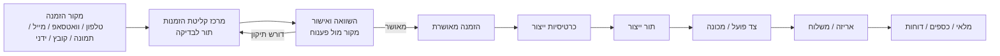

## כרטיסי מודולים: Input / Logic / Output

החלק הזה מיועד לאנשים חדשים שנכנסים לפרויקט. כל מודול חייב להישאר בגבולות
האחריות שלו. אם צריך מידע ממודול אחר - משתמשים ב-API או service מוגדר, לא
נוגעים ישירות במסך/טבלה של מודול אחר בלי אפיון.

### Platform Core

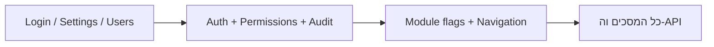

Input:

- פרטי התחברות.
- משתמשים, תפקידים והרשאות.
- הגדרות מערכת.
- מצב מודולים פעילים/כבויים.

Logic:

- מאמת זהות.
- קובע הרשאות לפי role.
- רושם פעולות רגישות ב-audit.
- מחליט אילו מודולים/מסכים זמינים ללקוח.

Output:

- JWT/session.
- הרשאות פעולה.
- תפריט מערכת.
- audit log.
- הגדרות זמינות לשאר המודולים.

אסור:

- להחזיק לוגיקה עסקית של הזמנות, ייצור, מלאי או כספים.
- להשתמש ב-role מזויף מהדפדפן.

### Orders - הזמנות

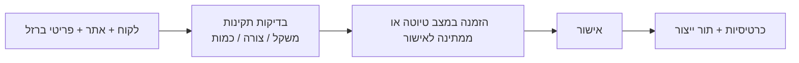

Input:

- לקוח או לקוח חדש מינימלי.
- פריטי ברזל: קוטר, כמות, אורך, צורה, זוויות, הערות.
- תאריך אספקה, עדיפות, כתובת/אתר.
- מקור: ידני, קליטה, קובץ, פורטל.

Logic:

- מחשב משקל.
- בודק צורות ומידות.
- שומר הזמנה, משטחים ופריטים.
- מנהל סטטוס הזמנה לפי חוזה סטטוסים.
- לא מכניס ייצור לפני אישור.

Output:

- order.
- pallets/items.
- סטטוס הזמנה.
- כרטיסיות ייצור.
- אירוע websocket לשאר המודולים.

אסור:

- לנהל מלאי בפועל.
- להפיק חיוב סופי.
- להכניס הזמנה לא מאושרת לייצור.

### Intake / OCR / AI - קליטת הזמנות

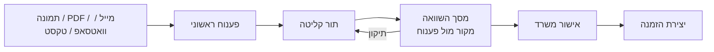

Input:

- קובץ מקור או טקסט מקור.
- מקור ההזמנה.
- פענוח AI/OCR אם זמין.
- תיקונים ידניים של משתמש.

Logic:

- שומר מקור גולמי.
- מייצר parsed data.
- מסמן שורות חשודות.
- מציע שיוך לקוח.
- מאפשר אישור רק מתוך מסך השוואה.

Output:

- intake_log.
- parsed order draft.
- שגיאות/אזהרות פענוח.
- order רק אחרי אישור.

אסור:

- ליצור הזמנה אוטומטית בלי אישור.
- לדרוס מקור.
- להסתיר כשל OCR.

### Production - ייצור

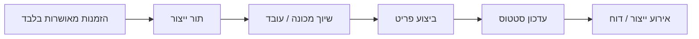

Input:

- פריטי הזמנה מאושרת.
- מכונה/עמדה.
- עובד/משמרת.
- סריקות וברקודים.
- עדכוני ביצוע.

Logic:

- מציג רק עבודה מאושרת.
- מנהל סטטוס פריט: ממתין, בייצור, בוצע, סופק.
- מתעד עצירות, משמרות ואירועים.
- מעדכן את מצב העבודה בזמן אמת.

Output:

- production queue.
- item status.
- production events.
- OEE/משמרת/עצירות.

אסור:

- לשנות פרטי הזמנה עסקיים.
- להציג מחיר/כספים לפועל.
- לייצר עבודה שלא אושרה.

### Production Cards - כרטיסיות ושרטוטים

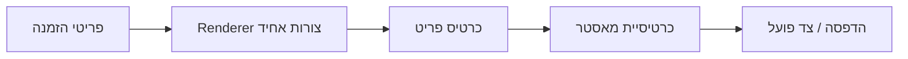

Input:

- item segments.
- shape name.
- quantity / production quantity.
- order/customer metadata.

Logic:

- מצייר צורה קריאה לייצור.
- שומר עקביות בין הדפסה, מסך, ופועל.
- מטפל בפיצול כרטיסיות.
- מייצר מאסטר מעודכן.

Output:

- כרטיסיית פריט.
- כרטיסיית מאסטר.
- תצוגת צד פועל.
- מסמכי הדפסה.

אסור:

- להשתמש ב-renderer שונה לכל מסך.
- לצייר U ארוך כקו בגלל פרופורציה אמיתית.
- לפצל כמות בלי לעדכן master.

### Inventory - מלאי

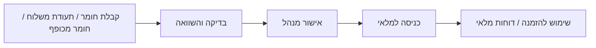

Input:

- חומר גלם: קוטר, סוג, משקל, ספק, תעודה.
- חומר מכופף שנשאר מהזמנה.
- מסמך ספק או צילום.
- מיקום מחסן.

Logic:

- מזהה חומר.
- מחשב/מאמת משקל.
- דורש השוואה מקור מול פענוח.
- מכניס למלאי רק אחרי אישור.
- מקשר חומר להזמנות ושימושים.

Output:

- raw material batch.
- stock movement.
- receiving review.
- התראות חוסר/עודף.

אסור:

- להכניס מלאי מפענוח ללא אישור.
- לערבב חומר גלם עם פריטי הזמנה בלי traceability.

### Procurement / Suppliers - רכש וספקים

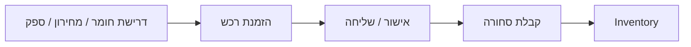

Input:

- ספק.
- מחירון ספק.
- דרישת חומר מהמלאי/ייצור.
- תאריך אספקה צפוי.

Logic:

- יוצר הזמנת רכש.
- משווה מחירון.
- עוקב אחרי ETA.
- מעביר קבלה למלאי.

Output:

- purchase order.
- supplier delivery note.
- עדכון מחיר/זמינות.
- אירוע קבלה למלאי.

אסור:

- לעדכן מלאי סופי בלי קבלה מאושרת.
- לערבב מחירון ספק עם מחירון לקוח בלי מודול Pricing.

### Customers / Projects - לקוחות ופרויקטים

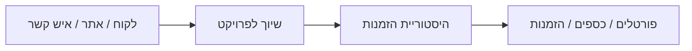

Input:

- פרטי לקוח.
- אנשי קשר.
- אתרים/פרויקטים.
- שיוך חיצוני או Priority ID.

Logic:

- מזהה לקוח.
- מונע כפילויות.
- שומר היסטוריה והקשרים.
- מספק נתוני לקוח להזמנה, כספים ופורטל.

Output:

- customer.
- project/site.
- contact.
- customer history.

אסור:

- לנהל אשראי/חשבוניות בתוך CRM.
- להעמיס הקמת לקוח מלאה במסך הזמנה חדשה.

### Finance / Pricing - כספים ומחירון

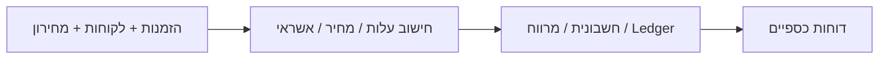

Input:

- הזמנה מאושרת/בוצעה.
- מחירון פנימי.
- תנאי לקוח.
- עלויות חומר ועבודה.
- תשלומים/חשבוניות.

Logic:

- מחשב עלות ומרווח.
- מנהל אשראי.
- מפיק חשבונית/אירוע כספי.
- שומר snapshot כדי שלא ישתנה רטרואקטיבית.

Output:

- invoice.
- cost snapshot.
- margin report.
- customer ledger.

אסור:

- לשנות פריטי ייצור.
- לנהל תמחור מתוך מסך הזמנה בלי service מוגדר.

### Logistics / Warehouse - לוגיסטיקה ומחסן

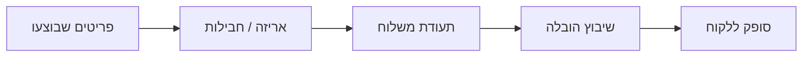

Input:

- פריטים שהושלמו.
- חבילות/משטחים.
- כתובת אספקה.
- נהג/רכב אם רלוונטי.

Logic:

- מקבץ פריטים לחבילות.
- יוצר תעודת משלוח.
- מנהל סטטוס משלוח.
- מעדכן סופק.

Output:

- package.
- delivery note.
- shipment status.
- delivered event.

אסור:

- לערבב ניהול רכב עם ניהול משלוח.
- לסמן סופק בלי trace של חבילה/תעודה.

### Fleet / Drivers - צי רכב ונהגים

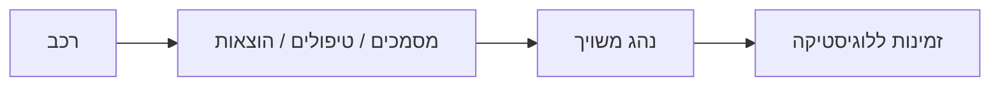

Input:

- רכב.
- נהג.
- טסט, ביטוח, טיפולים.
- הוצאות/הכנסות.
- מסמכים.

Logic:

- עוקב אחרי מצב רכב.
- מפריד רכב מנהג.
- מזהה חוסרים/פג תוקף.
- מספק זמינות ללוגיסטיקה.

Output:

- vehicle health.
- driver assignment.
- expense history.
- document archive.

אסור:

- להתייחס לנהג ורכב כאותה ישות.
- לנהל משלוח בפועל במקום Logistics.

### Quality / Maintenance - איכות ותחזוקה

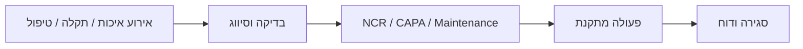

Input:

- בדיקת איכות.
- תקלה במכונה.
- אירוע בטיחות/איכות.
- PM schedule.

Logic:

- מסווג אירוע.
- פותח NCR/CAPA או טיפול.
- משנה מצב מכונה במקרה תקלה.
- דורש סגירה ואחריות.

Output:

- quality check.
- incident.
- NCR/CAPA.
- maintenance log.
- machine status update.

אסור:

- לשנות הזמנה עסקית.
- לעקוף workflow של סגירת תקלה/איכות.

### External Portals - פורטלים חיצוניים

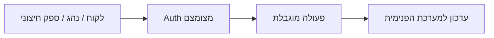

Input:

- לקוח עם token/OTP.
- נהג עם הרשאה.
- ספק עם הזמנת רכש.

Logic:

- נותן גישה מצומצמת בלבד.
- מציג רק מידע של אותו גורם.
- מתעד אישורים חיצוניים.

Output:

- אישור לקוח.
- עדכון נהג.
- תגובת ספק.
- אירוע למערכת הפנימית.

אסור:

- לחשוף `/api/orders` פנימי.
- לתת פורטל חיצוני עם הרשאת משתמש פנימי.

## קישורים למסמכי בסיס

- `docs/BUILD_RULES_HE.md`
- `docs/module-inventory.md`
- `docs/screen-registry.md`
- `docs/screen-compliance-map.md`
- `docs/project-recovery-plan.md`
- `docs/recovery-backlog.md`
- `docs/spec-gap-matrix.md`
- `docs/api-registry.md`
