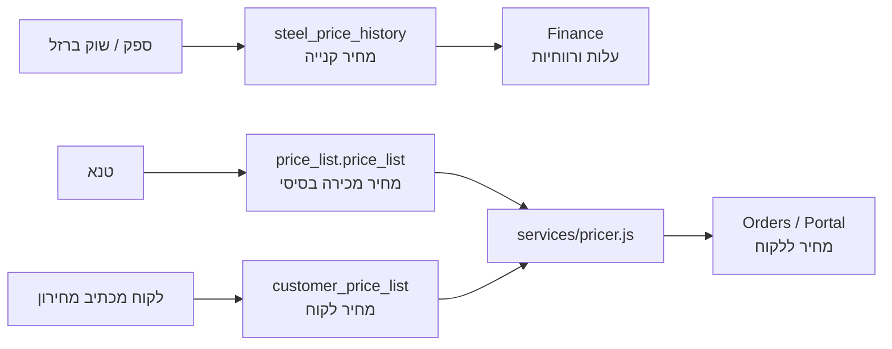

# אפיון: מחירון ברזל תלת-שכבתי

> בעלות: Pricing / Finance / Procurement / Customers.  
> כלל ברזל: אין יותר "מחיר ברזל" אחד. תמיד מפרידים בין מחיר קנייה, מחיר מכירה ומחיר לקוח.

## למה זה חשוב

מחיר הברזל משתנה כל הזמן. בנוסף, יש לקוחות גדולים שמכתיבים מחירון משלהם, והמערכת חייבת לדעת לעבוד גם עם מחירון טנא וגם עם מחירון לקוח בלי לערבב ביניהם.

טעות אסורה: להשתמש במחיר מכירה כדי לחשב עלות קנייה או רווחיות. זה יוצר מרווח שקרי.

## שלוש שכבות מחיר

| שכבה | מי קובע | מקור אמת | שימוש |
|---|---|---|---|
| מחיר קנייה | ספק / שוק ברזל | `steel_price_history` | עלות חומר, רווחיות, מחיר קנייה אחרון לפי קוטר וספק |
| מחיר מכירה בסיסי | טנא | `price_list.price_list` | מחיר ברירת מחדל ללקוחות רגילים |
| מחיר לקוח | הלקוח / הסכם לקוח | `customer_price_list` בעתיד, היום `price_list.price_cust` + `customers.price_tier` | לקוח שמכתיב מחיר או לקוח עם הסכם קבוע |

## בעלות מודולרית

| מודול | מה הוא מחזיק | מה מותר לו לעשות |
|---|---|---|
| Procurement / Inventory | מחיר קנייה מספקים ושוק ברזל (`steel_price_history`) | לעדכן עלות חומר לפי קוטר, ספק ותאריך |
| Catalog / Pricing | מחיר מכירה בסיסי של טנא (`price_list.price_list`) | לנהל מחירון מכירה רגיל |
| Customers / Portal | מחירון לקוח והסכמי לקוח (`customer_price_list`, היום `price_list.price_cust`) | לבחור האם לקוח עובד לפי מחירון טנא או מחירון שלו |
| Orders | צורך מחיר מכירה/לקוח דרך `services/pricer.js` | לא מחשב בעצמו מחירון ולא קורא מחיר קנייה |
| Finance | צורך מחיר קנייה לצורך עלות ורווחיות | לא משתמש במחיר מכירה כעלות חומר |

כל מודול לוקח את המחיר מהמקום שלו בלבד. אין טבלת קסם אחת ואין fallback שקט בין מחיר קנייה, מחיר מכירה ומחיר לקוח.

## כללי שימוש

1. `steel_price_history` הוא מקור מחיר הקנייה. הוא לא מחיר מכירה.
2. `price_list.price_list` הוא מחיר מכירה בסיסי. הוא לא עלות חומר.
3. `price_list.price_cust` הוא מחיר לקוח קבוע זמני/קיים. בעתיד הוא מוחלף או מורחב בטבלת `customer_price_list` פר-לקוח.
4. `customers.price_tier='customer'` אומר שהלקוח מקבל מחיר לקוח ולא מחירון רגיל.
5. `customers.discount_pct` הוא הנחה נוספת, לא מקור מחיר עצמאי.
6. אם אין מחיר קנייה בקוטר מסוים, Finance מחזיר אזהרת `cost_basis_missing` ולא ממציא עלות ממחיר מכירה.

## ארכיטקטורה רצויה



## מודל נתונים עתידי

### לקוחות

```sql
ALTER TABLE customers ADD COLUMN pricing_source TEXT DEFAULT 'tene';
-- 'tene'     = מחירון טנא
-- 'customer' = מחירון שהלקוח מכתיב
```

### מחירון לקוח פר לקוח

```sql
CREATE TABLE customer_price_list (
  id INTEGER PRIMARY KEY,
  customer_id INTEGER NOT NULL,
  diameter INTEGER NOT NULL,
  price_per_kg REAL NOT NULL,
  source TEXT, -- image | file | manual | api
  imported_at TEXT DEFAULT CURRENT_TIMESTAMP,
  approved_by INTEGER,
  approved_at TEXT,
  UNIQUE(customer_id, diameter),
  FOREIGN KEY (customer_id) REFERENCES customers(id)
);
```

## קליטת מחירון

`services/pricing-importer.js` צריך לתרגם פורמטים שונים למבנה פנימי אחד:

```js
{
  sourceType: 'image' | 'excel' | 'csv' | 'manual' | 'api',
  customerId,
  rows: [
    { diameter: 8, pricePerKg: 3.8, confidence: 0.94, raw: '...' }
  ],
  warnings: []
}
```

כל קליטה מתמונה/קובץ חייבת לעבור מסך השוואה ואישור לפני שמירה. לא שומרים OCR ישירות למחירון.

## מסלול החלטה בזמן הצעת מחיר


## Definition of Done

- [ ] אין שימוש ב-`price_list` לחישוב עלות קנייה.
- [ ] `services/pricer.js` הוא נקודת האמת למחיר מכירה/מחיר לקוח.
- [ ] `steel_price_history` הוא נקודת האמת למחיר קנייה.
- [ ] מחירון לקוח עובר אישור לפני שמירה.
- [ ] מסך לקוח מציג בבירור: מחירון טנא / מחירון לקוח.
- [ ] Finance מציג אזהרה אם חסר מחיר קנייה ולא מחשב רווחיות שקרית.

## החלטת מחיר בפורטל לקוח ובהצעת מחיר

בפורטל לקוח אין “מחיר ברזל” אחד. בכל הצעת מחיר המערכת חייבת לדעת מאיזה מקור מחיר היא לקחה את המחיר, ולהציג זאת למנהל/לקוח בצורה ברורה.

### שני מצבי מחיר ללקוח

| מצב לקוח | מאיפה ההצעה לוקחת מחיר | מי מנהל | הערה |
|---|---|---|---|
| לקוח שוטף רגיל | מחירון מכירה כללי של טנא | Pricing / Catalog | ברירת מחדל לכל לקוח שאין לו הסכם אישי |
| לקוח עם מחירון אישי | מחירון אישי של הלקוח | Customers / Pricing | לקוחות שמכתיבים מחיר או שיש להם הסכם קבוע |

### כלל עדיפות להצעת מחיר

1. אם ללקוח מוגדר `pricing_source = customer`, הצעת המחיר חייבת לנסות לקחת מחיר מ-`customer_price_list`.
2. אם חסר מחיר אישי לקוטר מסוים, לא מסתירים את זה. מחזירים אזהרה `customer_price_missing`.
3. במקרה כזה אפשר להציג fallback למחירון הכללי, אבל הוא חייב להיות מסומן כ-“מחיר זמני לאישור”, לא כמחיר סופי.
4. אם ללקוח מוגדר `pricing_source = general`, ההצעה לוקחת מחיר מ-`price_list.price_list`.
5. `discount_pct` מוחל רק אחרי שנבחר מקור המחיר. הוא לא מחליף מחירון.
6. כל הצעת מחיר נשמרת עם snapshot:
   - `pricing_source`
   - `price_list_id` או `customer_price_list_id`
   - `diameter`
   - `unit_price`
   - `discount_pct`
   - `calculated_at`

### מה אסור

- אסור שלקוח עם מחירון אישי יקבל בטעות מחירון כללי בלי אזהרה.
- אסור שהפורטל יחשב מחיר בעצמו בצד לקוח.
- אסור לערבב מחיר קנייה עם מחיר מכירה.
- אסור לעדכן מחירון אישי מתוך OCR בלי מסך השוואה ואישור מנהל.

### תצוגה נדרשת בפורטל

במסך הצעת מחיר ובמסך פרטי הזמנה ללקוח יוצג תג קטן:

- “מחירון כללי” ללקוח רגיל.
- “מחירון אישי” ללקוח שמחושב לפי מחירון לקוח.
- “חסר מחיר אישי - דורש אישור” אם לקוח אישי ביקש קוטר שאין לו מחיר.
