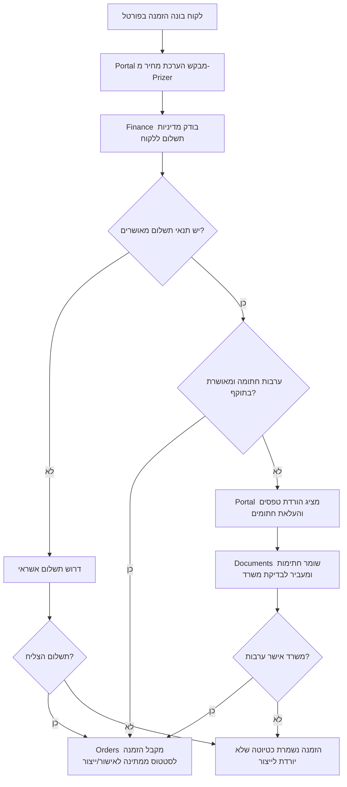

# אפיון: פורטל לקוח - תשלום, ערבות ודשבורד הזמנות

> סטטוס: אפיון מחייב, טרם בוצע במלואו.  
> בעלות ראשית: Portal.  
> מודולים משתתפים: Finance, Orders, Documents, Reports, Customers.

---

## 1. מטרה

פורטל הלקוח צריך להוריד ממאיר ומהמשרד עבודה ידנית:

- לקוח יכול להזמין לבד.
- לקוח יודע אם הוא צריך לשלם באשראי או שהוא עובד בתנאי תשלום.
- לקוח עם תנאי תשלום מוריד טפסי ערבות, מעלה אותם חתומים, וממתין לאישור.
- לקוח רואה את כל ההזמנות שלו, תעודות המשלוח והחשבוניות.
- לקוח רואה כמה ברזל הלך לכל אתר וכמה כסף יצא על כל פרויקט.

הפורטל הוא חלון הלקוח. הוא לא מחליף את Finance, Orders או Documents.

---

## 2. כלל עסקי מרכזי

כל הזמנת לקוח מהפורטל חייבת לעבור אחד משני מסלולים:

| סוג לקוח | תנאי להמשך הזמנה | מה קורה בפורטל |
|---|---|---|
| לקוח ללא תנאי תשלום מאושרים | סליקת אשראי חובה | אחרי בניית ההזמנה מוצג מסך תשלום. ההזמנה לא מאושרת לייצור לפני תשלום מוצלח. |
| לקוח עם תנאי תשלום מאושרים | טפסי ערבות חתומים ומאושרים | הלקוח יכול להגיש הזמנה על חשבון תנאי התשלום, רק אם מסמכי הערבות בתוקף. |
| לקוח עם תנאי תשלום אבל ללא ערבות מאושרת | חסימה רכה לפני אישור | הפורטל מציג: "נדרשת ערבות חתומה". הלקוח מוריד טפסים ומעלה חתומים. |

אין מצב שבו הזמנה מהפורטל נכנסת לייצור בלי אחד מאלה:

1. תשלום אשראי מאושר.
2. תנאי תשלום פעילים + ערבות מאושרת.
3. אישור מנהל חריג ומתועד.

---

## 3. גבולות אחריות

| מודול | אחריות |
|---|---|
| Portal | מציג ללקוח הזמנות, תשלומים, טפסים, העלאות, דשבורד ופעולות פורטל. |
| Finance | מחליט אם לקוח חייב אשראי, אם יש תנאי תשלום, מסגרת אשראי, סטטוס תשלום וחשבוניות. |
| Documents | שומר קבצי מקור, טפסי ערבות להורדה, וטפסים חתומים שהלקוח העלה. |
| Orders | מקבל הזמנה רק אחרי שהפורטל מחזיר מצב עסקי תקין: `paid`, `terms_approved`, או `manager_override`. |
| Reports | מספק סיכומי ברזל וכסף לפי אתר, פרויקט וטווח תאריכים. |
| Customers | מחזיק את שיוך הלקוח, אנשי קשר, אתרים והרשאות פורטל. |

אסור:

- לשמור לוגיקת אשראי בתוך `public/customer.html`.
- לחשוף מחיר קנייה או רווחיות בפורטל.
- לאפשר ללקוח לראות הזמנות של לקוח אחר.
- לאשר הזמנה לייצור רק בגלל שהלקוח לחץ "שלח".

---

## 4. מסלול הזמנה מהפורטל



---

## 5. טפסי ערבות

### הלקוח צריך לראות

- סטטוס תנאי תשלום: לא מוגדר / ממתין ערבות / בבדיקת משרד / מאושר / נדחה / פג תוקף.
- כפתור הורדת טפסים.
- כפתור העלאת טפסים חתומים.
- היסטוריית העלאות: תאריך, מי העלה, סטטוס, הערת משרד.

### סוגי מסמכים

| סוג מסמך | חובה? | מי מאשר |
|---|---|---|
| בקשה לתנאי תשלום | כן | Finance / Manager |
| כתב ערבות / התחייבות | כן ללקוח בתנאי תשלום | Finance / Manager |
| צילום תעודת זהות / מורשה חתימה | לפי צורך | Office / Manager |
| מסמך חברה / ח.פ | לפי צורך | Office / Manager |

### סטטוסים

```text
missing -> uploaded_pending_review -> approved
missing -> uploaded_pending_review -> rejected
approved -> expired
approved -> revoked
```

---

## 6. דשבורד לקוח

דף הבית של הלקוח בפורטל צריך להיות דשבורד שימושי, לא רק טופס הזמנה.

### אזורים בדשבורד

| אזור | מה מוצג |
|---|---|
| הזמנות אחרונות | מספר הזמנה, אתר/פרויקט, סטטוס, משקל, תאריך אספקה, סכום אם מותר לראות מחיר |
| מסמכים להזמנה | תעודות משלוח, חשבוניות, כרטיסיות / מסמכי ייצור אם מאושר לחשיפה |
| סיכום אתרים | כמה ק"ג/טון ברזל הלך לכל אתר |
| סיכום פרויקטים | כמה כסף הוצא בכל פרויקט, לפי טווח תאריכים |
| תשלום וערבות | סטטוס אשראי, תנאי תשלום, טפסים חסרים, תשלומים פתוחים |

### תצוגת הזמנה בפורטל

לקוח לא רואה רק מספר הזמנה. הוא חייב לראות:

- פרטי לקוח ואתר.
- שורות הברזל: קוטר, צורה, מידות, כמות, משקל.
- סטטוס כללי.
- מסמכים קשורים.
- חשבוניות ותעודות משלוח.
- אם יש מחירון אישי/כללי, מקור המחיר שמותר להציג לו.

---

## 7. API מוצע

### Portal

| Method | Path | שימוש |
|---|---|---|
| GET | `/api/c/dashboard` | דשבורד לקוח מלא |
| GET | `/api/c/orders` | רשימת הזמנות של הלקוח בלבד |
| GET | `/api/c/orders/:id` | פרטי הזמנה מלאה של הלקוח |
| GET | `/api/c/orders/:id/documents` | תעודות וחשבוניות להזמנה |
| GET | `/api/c/projects/summary` | סיכום ברזל וכסף לפי פרויקט |
| GET | `/api/c/sites/summary` | סיכום ברזל לפי אתר |
| POST | `/api/c/order` | יצירת טיוטת הזמנה או מעבר למסלול תשלום/ערבות |

### Payment / Terms

| Method | Path | שימוש |
|---|---|---|
| GET | `/api/c/payment-policy` | האם הלקוח חייב אשראי או תנאי תשלום |
| POST | `/api/c/payments/checkout` | פתיחת סליקת אשראי להזמנה |
| GET | `/api/c/terms/status` | סטטוס תנאי תשלום וערבות |
| GET | `/api/c/terms/templates` | טפסים להורדה |
| POST | `/api/c/terms/upload` | העלאת טופס חתום |

---

## 8. אירועים

| אירוע | מפיק | צורך |
|---|---|---|
| `portal.order_submitted` | Portal | Orders, Finance |
| `portal.payment_required` | Finance/Portal | Portal UI |
| `portal.payment_completed` | Finance | Orders, Portal |
| `portal.guarantee_required` | Finance | Portal, Documents |
| `portal.guarantee_uploaded` | Documents/Portal | Finance, Office |
| `portal.guarantee_approved` | Finance | Orders, Portal |
| `portal.guarantee_rejected` | Finance | Portal |

---

## 9. נתונים נדרשים

### Customer Payment Policy

```json
{
  "customerId": 17,
  "paymentMode": "credit_card_required",
  "paymentTermsApproved": false,
  "creditLimit": null,
  "guaranteeStatus": "missing"
}
```

```json
{
  "customerId": 18,
  "paymentMode": "payment_terms",
  "paymentTermsApproved": true,
  "creditLimit": 100000,
  "guaranteeStatus": "approved",
  "guaranteeValidUntil": "2027-06-30"
}
```

### Portal Order Response

```json
{
  "orderDraftId": 223,
  "status": "payment_required",
  "nextAction": "credit_card_checkout",
  "message": "נדרש תשלום אשראי לפני אישור ההזמנה"
}
```

```json
{
  "orderDraftId": 224,
  "status": "guarantee_required",
  "nextAction": "upload_signed_guarantee",
  "message": "נדרשת ערבות חתומה לפני אישור ההזמנה"
}
```

---

## 10. Definition of Done

- לקוח יכול לראות דשבורד פורטל מלא.
- לקוח יכול לראות פרטי הזמנה ולא רק מספר הזמנה.
- לקוח רואה תעודות משלוח וחשבוניות לפי הזמנה.
- לקוח רואה סיכום ק"ג/טון לפי אתר.
- לקוח רואה סיכום הוצאה לפי פרויקט.
- לקוח ללא תנאי תשלום לא יכול לאשר הזמנה בלי סליקה.
- לקוח עם תנאי תשלום לא יכול לאשר הזמנה בלי ערבות מאושרת.
- טפסי ערבות ניתנים להורדה ולהעלאה חתומה.
- כל העלאת ערבות נשמרת ב-Documents ולא מוחקת מקור.
- Finance הוא מקור האמת לתשלום, אשראי ותנאי תשלום.
- Orders לא מקבל הזמנה לייצור בלי אישור תשלום/תנאי תשלום.

