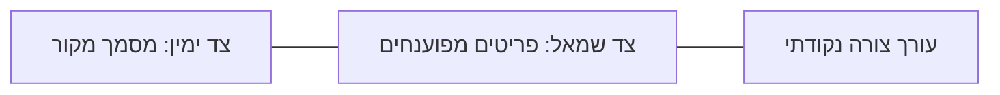

# מודול V2: Intake / OCR — קליטת מסמכים ופענוח

## מטרת המודול

מודול Intake/OCR הוא שער הכניסה של מסמכים חיצוניים למערכת IronBend. הוא קולט מסמכים, מפענח אותם, מציג השוואה ויזואלית מול המקור, מאפשר תיקון אנושי, ומייצר טיוטת הזמנה בלבד.

המודול אינו מנהל הזמנה סופית, אינו יוצר כרטיסיות ייצור, ואינו מעדכן מלאי. הוא אחראי רק על קליטה, פענוח, השוואה, תיקון, אישור והעברה למודול Orders.

## משתמשים

| משתמש | הרשאות עיקריות |
|---|---|
| פקיד/ת קליטת הזמנות | העלאה, פענוח, תיקון שדות, שמירה כטיוטה |
| איש מכירות | העלאה ובדיקת טיוטות של לקוחות שלו |
| מנהל | אישור סופי, טיפול בשדות בסיכון, ניהול תבניות ואימון |
| מנהל מערכת | הגדרות OCR/API, ניטור, הרשאות, תורים |

## גבולות אחריות

### בתוך המודול

- קליטת PDF, תמונה, מייל, WhatsApp, Excel/CSV ושרטוטים תעשייתיים.
- שמירת מסמך מקור ללא שינוי.
- פענוח נתונים מובנים מתוך מסמך.
- הצגת מקור מול פענוח בתצוגה מפוצלת.
- תיקון שדות וצורות לפני אישור.
- ניהול confidence score לכל שדה.
- מניעת כפילויות לפני אישור.
- שמירת תיקוני משתמש לטובת אימון עתידי.
- יצירת טיוטת הזמנה מאושרת למודול Orders.

### מחוץ למודול

- יצירת הזמנה סופית וניהול lifecycle שייכים ל־Orders.
- חישוב משקל מקצועי וצורות ברזל שייכים ל־Steel/Rebar.
- כרטיסיות ייצור וברקודים שייכים ל־Production Cards.
- מלאי וקבלת חומר שייכים ל־Inventory/Procurement.
- מחירונים ותמחור שייכים ל־Pricing.

## קלט

| סוג קלט | דוגמאות | הערות |
|---|---|---|
| PDF | טופס הזמנה, רשימת ברזל, תעודת משלוח | נשמר כ־source document |
| תמונה | צילום וואטסאפ, צילום דף ידני | נדרש zoom/rotation/crop במסך השוואה |
| WhatsApp | הודעת טקסט, תמונה, PDF | נכנס לתור קליטה, לא להזמנה ישירה |
| מייל | גוף מייל + attachments | מקור נשמר עם metadata |
| CSV/Excel | טבלת הזמנה | מיובא כטבלה, לא כ־OCR תמונה |
| BVBS/Tekla | קבצי שרטוט תעשייתיים | מנותבים לפרסר תעשייתי מתאים |
| הזנה ידנית | טקסט חופשי או שורות ידניות | נשמרת עם source=manual |

## פלט

| פלט | יעד | תנאי |
|---|---|---|
| source_document | Archive/Audit | תמיד |
| intake_draft | Intake | לאחר פענוח ראשוני |
| intake_review_items | Intake | לכל שדה/שורה עם ודאות נמוכה או הערה |
| corrected_items | Intake | לאחר תיקון אנושי |
| approved_order_draft | Orders | רק אחרי אישור אנושי |
| training_examples | OCR Training | רק מתיקונים שהמשתמש אישר |
| events | Event Bus / Audit | בכל שינוי משמעותי |

## עקרון ברזל

OCR לעולם לא יוצר הזמנה סופית. OCR יוצר טיוטה בלבד. מעבר להזמנה מחייב השוואה מול מקור ואישור אנושי.

## זרימת עבודה

```mermaid
flowchart RTL
  A["מסמך נכנס"] --> B["שמירת מקור ללא שינוי"]
  B --> C["פענוח OCR/AI/Parser"]
  C --> D["טיוטת קליטה"]
  D --> E["השוואה מקור מול פענוח"]
  E --> F{"כל שדה תקין?"}
  F -- "לא" --> G["תיקון שדה / עריכת צורה"]
  G --> H["שמירת תיקון לאימון"]
  H --> E
  F -- "כן" --> I["בדיקת כפילות"]
  I --> J{"כפילות?"}
  J -- "כן" --> K["סימון לבדיקה ידנית"]
  J -- "לא" --> L["אישור טיוטה"]
  L --> M["שליחה ל-Orders"]
```

## מסך: מרכז קליטת הזמנות

### מטרת המסך

המסך מציג תור מסמכים נכנסים שעדיין לא הפכו להזמנה. הוא מאפשר להבין במהירות מה מחכה לאישור, מאיזה מקור הגיע, מה רמת הסיכון, ומה צריך טיפול.

### אזורי מסך

| אזור | תוכן |
|---|---|
| Header | שם המסך, כפתור העלאה, פילטר מקור, חיפוש |
| מדדי תור | ממתינים לאישור, דורשים שיוך לקוח, דחופים, פריטים שפוענחו |
| רשימת מסמכים | כל מסמך ככרטיס עבודה עם מקור, לקוח משוער, תאריך, סטטוס, confidence |
| פעולות מהירות | פתח להשוואה, דחה, שייך לקוח, סמן דחוף |

### מה אסור במסך המרכזי

- לא לערוך הזמנה מלאה במסך זה.
- לא להציג טופס לקוח מלא.
- לא להציג גוש מלל ארוך במקום פריטים ויזואליים.
- לא לאשר לייצור מתוך המרכז בלי כניסה למסך השוואה.

## מסך: השוואה ואישור OCR

### עקרון UX

המשתמש משווה מול צורה ומידות, לא מול טקסט AI. כל פריט מפוענח מוצג ככרטיס ויזואלי ברור עם צורה, מידות, כמות, קוטר, confidence והערות.

### פריסה



| צד | דרישות |
|---|---|
| מקור | PDF/תמונה עם zoom, pan, rotate, מעבר עמודים, שמירת מיקום צפייה |
| פענוח | כרטיסים/טבלה ויזואלית, שדות עריכים, צורות ברזל מצוירות |
| פעולה | אישור שורה, עריכת צורה, דחייה, אישור סופי לטיוטה |

### כרטיס פריט מפוענח

כל פריט חייב לכלול:

- מספר שורה במסמך המקור.
- צורה ויזואלית ברורה.
- קוטר ברזל.
- כמות.
- אורך כולל / מידות צלעות.
- זוויות רק אם הצורה מקופפת.
- קוטר ספירלה ומספר כריכות רק אם הצורה היא ספירלה.
- משקל משוער אם ניתן לחשב.
- confidence לכל שדה קריטי.
- סטטוס: תקין / דרוש בדיקה / חסר נתון / כפילות חשודה.

## חוקי צורה במסך OCR

מודול Intake אינו ממציא חישובי ברזל; הוא משתמש בחוזה של מודול Steel/Rebar. עם זאת, המסך חייב לדעת איזה שדות להציג לפי סוג הצורה.

| סוג צורה | שדות מוצגים | שדות שלא מוצגים |
|---|---|---|
| מוט ישר | קוטר, אורך, כמות | זוויות, צלעות מרובות, קוטר ספירלה |
| צורה מקופפת | קוטר, צלעות, זוויות, כמות | קוטר ספירלה, מספר כריכות |
| חישוק | קוטר, צלעות, כמות, סימון חישוק פנימי | קוטר ספירלה, מספר כריכות |
| ספירלה | קוטר ברזל, קוטר ספירלה, מספר כריכות, כמות | זוויות כיפוף |
| BVBS/Tekla | לפי payload מובנה | ניחוש OCR חופשי |

### חישוק

סימון חישוק הוא ריבוע/מלבן עם סימן פינה פנימית. הסימון תמיד פונה פנימה. אסור לצייר אותו החוצה. התוספת היא חלק פנימי של סימון הפינה/חפיפה, לא שתי קרניים או קווים חיצוניים.

### ספירלה

ספירלה אינה מקבלת זוויות. הפרמטרים המחייבים הם:

- קוטר ברזל.
- קוטר ספירלה.
- מספר כריכות.
- כמות יחידות, אם יש יותר מספירלה אחת.

## Confidence ושדות בסיכון

כל ערך מפוענח מקבל confidence בין 0 ל־1.

| רמה | פעולה |
|---|---|
| 0.90 ומעלה | ניתן לאישור מהיר, עדיין מוצג למשתמש |
| 0.70–0.89 | מסומן לבדיקה קלה |
| מתחת 0.70 | חייב אישור אנושי מפורש |
| חסר / לא הגיוני | לא ניתן לאישור סופי, רק שמירה כטיוטה |

שדה בסיכון חייב להופיע כמשימה בתוך מסך ההשוואה, לא כהערה צהובה כללית בלבד.

## מסלול הערות / בעיות

כאשר OCR יוצר הערה כגון "אורך לא תואם" או "צורה לא ודאית", ההערה הופכת ל־review item עם סטטוס.

| סטטוס | משמעות |
|---|---|
| open | דורש בדיקה |
| accepted | המשתמש אישר את הפענוח כמו שהוא |
| corrected | המשתמש תיקן את הערך |
| rejected | השורה לא רלוונטית או שגויה |
| escalated | נדרש מנהל / איש מקצוע |

כל review item חייב לכלול:

- קישור לשורה/אזור במסמך המקור.
- השדה הבעייתי.
- הערך המקורי שחולץ.
- הערך המתוקן, אם תוקן.
- מי אישר ומתי.
- האם התיקון נשלח לאימון.

## מניעת כפילויות

לפני אישור סופי לטיוטה, המערכת בודקת כפילות לפי:

- hash של קובץ המקור.
- שם לקוח + תאריך + מספר מסמך חיצוני.
- דמיון פריטי הזמנה.
- מקור הודעה חיצוני: WhatsApp message id / email message id.

אם נמצאה כפילות, לא חוסמים שמירה כטיוטה, אבל חוסמים אישור להזמנה עד החלטת משתמש.

## שמירת מקור וארכיון

מסמך המקור נשמר ללא שינוי. אין לערוך, להחליף, למחוק או לכתוב עליו תוצאות OCR. כל פענוח נשמר כ־metadata נפרד.

## Feedback Loop / אימון OCR

כל תיקון מאושר יכול להפוך לדוגמת אימון.

```mermaid
flowchart RTL
  A["OCR טעה"] --> B["משתמש תיקן"]
  B --> C["נשמר correction"]
  C --> D["נוצר training example"]
  D --> E["שיפור זיהוי ללקוח/פורמט דומה"]
```

התיקון לא מתקן את מסמך המקור. הוא מתקן רק את הפענוח ואת דוגמת האימון.

## סטטוסים

| סטטוס | תיאור |
|---|---|
| received | מקור התקבל ונשמר |
| parsing | פענוח רץ ברקע |
| parsed | נוצרה טיוטת פענוח |
| needs_review | יש שדות/שורות שדורשים בדיקה |
| duplicate_suspected | נמצאה כפילות חשודה |
| corrected | בוצעו תיקונים |
| approved | אושר להעברה ל־Orders |
| rejected | נדחה |
| failed | הפענוח נכשל, המקור עדיין שמור |

## API Contract מוצע

| Method | Path | מטרה | הרשאה |
|---|---|---|---|
| POST | `/api/intake/sources` | יצירת רשומת מקור והעלאת קובץ | office |
| GET | `/api/intake/sources` | תור מקורות ממתינים | office |
| GET | `/api/intake/sources/:id` | פרטי מקור + טיוטה | office |
| POST | `/api/intake/sources/:id/parse` | התחלת פענוח ברקע | office |
| PATCH | `/api/intake/drafts/:id/items/:itemId` | תיקון שדה/פריט | office |
| POST | `/api/intake/drafts/:id/review-items/:reviewId/resolve` | סגירת הערה/בעיה | office |
| POST | `/api/intake/drafts/:id/approve` | אישור טיוטה ל־Orders | manager/office לפי policy |
| POST | `/api/intake/drafts/:id/reject` | דחיית טיוטה | office |
| GET | `/api/intake/training/examples` | דוגמאות אימון | manager |
| POST | `/api/intake/training/examples` | שמירת דוגמת אימון | manager |

## Events

| Event | מתי נוצר | צרכנים |
|---|---|---|
| `intake.source.received` | מקור נשמר | Dashboard, Audit |
| `intake.parse.started` | התחיל פענוח | UI realtime |
| `intake.parse.completed` | הסתיים פענוח | UI, Orders draft queue |
| `intake.review.required` | נוצרה הערת בדיקה | UI, Manager alerts |
| `intake.item.corrected` | משתמש תיקן שדה/צורה | Training, Audit |
| `intake.duplicate.detected` | נמצאה כפילות | UI, Audit |
| `intake.draft.approved` | אושר להעברה להזמנה | Orders |
| `intake.draft.rejected` | נדחה | Audit |
| `intake.training.example.created` | נשמר תיקון לאימון | OCR Training |

כל אירוע חייב לכלול: `eventId`, `sourceId`, `draftId` אם קיים, `actorUserId`, `createdAt`, `confidenceSummary`, ו־`sourceChannel`.

## DB Ownership מוצע

| Entity | בעלים | הערות |
|---|---|---|
| `intake_sources` | Intake | מקור, hash, channel, storage path, metadata |
| `intake_drafts` | Intake | מצב פענוח, לקוח משוער, summary |
| `intake_draft_items` | Intake | פריטים מפוענחים ומתוקנים |
| `intake_review_items` | Intake | שדות/הערות שמחכים לאישור |
| `intake_corrections` | Intake | תיקוני משתמש |
| `intake_training_examples` | Intake/OCR Training | דוגמאות אימון |

מודול Orders מקבל רק `approved_order_draft`, ולא כותב לטבלאות Intake.

## Permissions

| פעולה | תפקידים |
|---|---|
| צפייה בתור קליטה | office, sales, manager, admin |
| העלאת מקור | office, sales, manager, admin |
| תיקון שדות | office, manager, admin |
| אישור טיוטה | office, manager, admin |
| אישור חריג confidence נמוך | manager, admin או office עם policy מפורש |
| ניהול דוגמאות אימון | manager, admin |
| מחיקת מקור | admin בלבד, עם audit ו-soft delete בלבד |

## קשרים למודולים אחרים

```mermaid
flowchart RTL
  A["Channels: WhatsApp / Email / Upload"] --> B["Intake/OCR"]
  B --> C["Steel/Rebar Shape Rules"]
  B --> D["Orders"]
  B --> E["OCR Training"]
  D --> F["Production Cards"]
  D --> G["Pricing"]
  B --> H["Archive / Audit"]
```

## Definition of Done לאפיון

- מסך מרכז קליטת הזמנות מוגדר ללא ערבוב עם ניהול הזמנה.
- מסך השוואה מקור מול פענוח מוגדר עם צורות ויזואליות, לא גוש מלל.
- עורך צורה נקודתי מוגדר.
- מסלול הערות/בעיות מוגדר עם סטטוסים.
- Confidence מוגדר ברמת שדה.
- כפילויות מוגדרות.
- API, events, permissions ו־DB ownership מוגדרים.
- הקשר ל־Steel/Rebar, Orders ו־Training מוגדר.

## שאלות פתוחות למאיר

1. האם איש מכירות רשאי לאשר טיוטה להזמנה, או רק פקיד/מנהל?
2. האם confidence נמוך דורש מנהל תמיד, או שניתן לאשר לפי הרשאה משרדית?
3. האם מסמכי ספק/קבלת חומר למלאי משתמשים באותו Intake או במודול Inventory Intake נפרד עם אותו מנוע OCR?
4. האם תיקוני OCR נשלחים לאימון אוטומטית או רק אחרי סימון מפורש של מנהל?

## חוק מכונה לחישוק: עודף הופך לצלע ראשונה ואחרונה

בחישוק עם אורך כולל גדול מסכום הצלעות הגיאומטריות, ההפרש הוא עודף סגירה. לצורך תצוגה למשתמש אפשר להציג אותו כ"עודף פתיחה" ו"עודף סגירה", אבל לצורך מעבר למכונה הוא חייב להפוך לשתי צלעות אמיתיות ברצף המכונה.

נוסחה:

- `visibleSegmentsSum = sum(visibleSegments)`
- `surplusTotal = totalLength - visibleSegmentsSum`
- `startSegment = surplusTotal / 2`
- `endSegment = surplusTotal / 2`
- `machineSegments = [startSegment, ...visibleSegments, endSegment]`

דוגמה מחייבת:

- צלעות נראות: `100, 100, 100, 100`
- אורך כולל: `420`
- סכום צלעות נראה: `400`
- עודף כולל: `20`
- צלע מכונה ראשונה: `10`
- צלע מכונה אחרונה: `10`

לכן למכונה עובר:

```json
{
  "shapeType": "stirrup",
  "visibleSegments": [100, 100, 100, 100],
  "totalLength": 420,
  "surplusTotal": 20,
  "machineSegments": [10, 100, 100, 100, 100, 10]
}
```

אסור להעביר למכונה רק `[100,100,100,100]` עם הערת עודף בצד. העודף חייב להיות חלק מהרצף המכני כצלע ראשונה וצלע אחרונה.

## חוק ספירלה: פרמטרים ייעודיים ללא צלעות וזוויות

ספירלה אינה צורה מקופפת רגילה. אסור להציג או להעביר עבורה צלעות וזוויות. ספירלה מוגדרת לפי פרמטרים ייעודיים בלבד.

שדות חובה:

- `barDiameter` — קוטר ברזל.
- `coilDiameter` — קוטר ספירלה כפי שמופיע בטופס.
- `turns` — מספר כריכות.
- `quantity` — כמות יחידות, אם יש יותר מספירלה אחת.

שדות אופציונליים:

- `pitch` — פסיעה / מרווח בין כריכות, אם מופיע או נדרש למכונה.
- `diameterBasis` — בסיס הקוטר (`form_value`, `inner`, `outer`, `centerline`). בשלב האפיון ברירת המחדל היא `form_value`, כלומר הקוטר כפי שהלקוח/הטופס מציין.

דוגמה:

```json
{
  "shapeType": "spiral",
  "barDiameter": 8,
  "quantity": 1,
  "spiral": {
    "coilDiameter": 50,
    "diameterBasis": "form_value",
    "turns": 160,
    "pitch": null
  }
}
```

כלל UI ומכונה:

- אין להציג שדות זווית בספירלה.
- אין להציג צלע א/ב/ג/ד בספירלה.
- אין לחשב עודף קצוות כמו בחישוק.
- השרטוט חייב להיראות כעיגול/ספירלה במבט על, עם קו קוטר מסומן וברור (`coilDiameter`). אסור להציג ספירלה כקו גלי או כצורה מקופפת.
- אם OCR מזהה ספירלה אך חסרים `coilDiameter` או `turns`, השורה נשמרת כטיוטה בלבד ודורשת תיקון אנושי.


